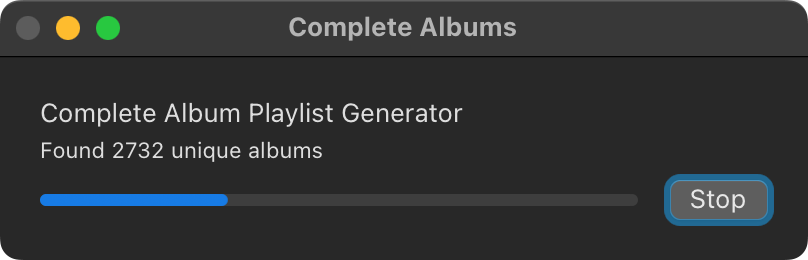
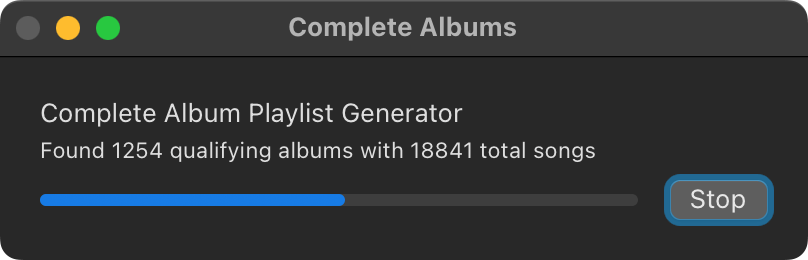
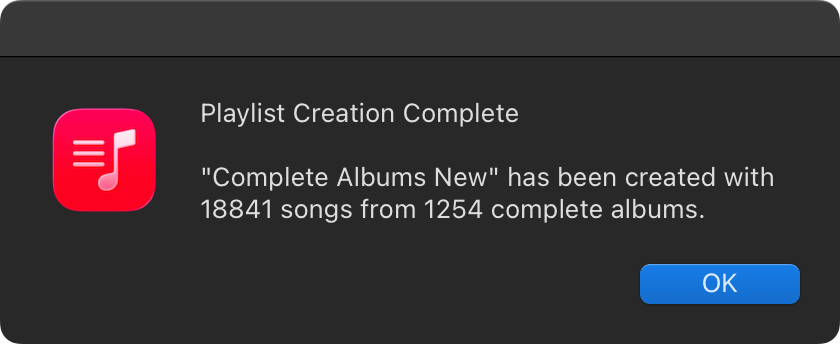

 

Finds all complete albums (7+ songs) in your Apple Music library and puts them all into a playlist.

<a href="#features">Features</a> &bull; <a href="#installation">Installation</a>

-----

## Complete Albums to Playlist

This is an Apple Script for Apple Music on macOS that will create a playlist called "Complete Albums" that contains all albums with more than 7 songs.

From there, you can use the playlist as a base, and create Smart Playlists to have all complete albums from one genre, or maybe everything minus a genre. Go wild!

If you find any bugs, please raise an issue.

 
 
 

## Features

- Automatically creates playlists from complete albums (7+ songs)
- Scans your entire Apple Music library for qualifying albums
- Smart duplicate removal
- Safe playlist creation - if another playlist called "Complete Albums" exists, it will create a new one without overwriting the old
- Relatively fast even for large music libraries - on my library it takes ~10 minute to complete

## Installation

> [!CAUTION]
> BACKUP YOUR MUSIC LIBRARY FIRST. 
> I am not responsible for any data loss, and this app comes with zero guarantees.

1. Download and unzip the [latest release](https://github.com/realrogue/kagi-darker/releases/latest).
1. Copy the `.app` to `~/Library/Music/Scripts/`.
1. Open Apple Music if it's not already open.
1. Open the scripts menu in the menu bar and click on "Complete Albums to Playlist"
1. Let it run and enjoy!

---

This was heavily inspired by [dougscripts](https://dougscripts.com). If you love music, and use Apple Music or iTunes, give his site a visit. The best Apple Scripter in the world!
